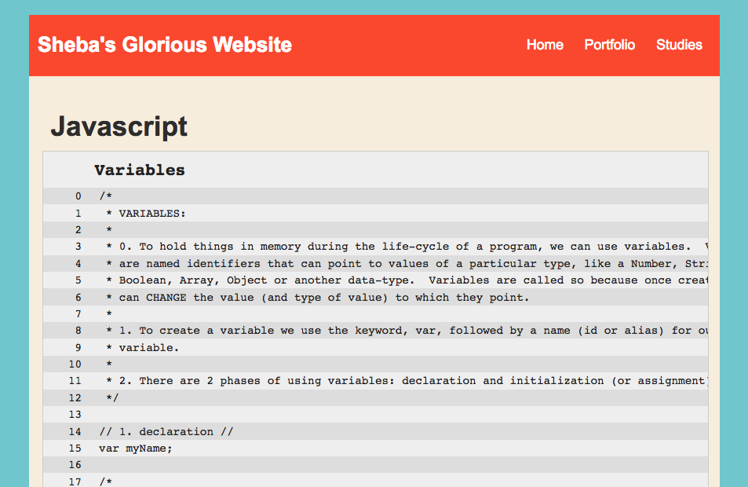

# Studies

**Table of Contents**

* [Overview](#overview)
* [Setup](#setup)
    + [TODO 1 - Create studies directory](#todo-1---create-studies-directory)
    + [TODO 2 - Create studies.html](#todo-2---create-studieshtml)
    + [TODO 3 - Add HTML](#todo-3---add-html)
    + [TODO 4 - Add CSS](#todo-4---add-css)
    + [TODO 5 - Link other pages](#todo-5---link-other-pages)
* [Create notes per JavaScript Subtopic](#create-notes-per-javascript-subtopic)
    + [TODO 6 - Add first note](#todo-6---add-first-note)
    + [TODO 7 - Add more notes](#todo-7---add-more-notes)
        - [Variables](#variables)
        - [Datatypes](#datatypes)
        - [Operators](#operators)
        - [String manipulation](#string-manipulation)
        - [Control flow](#control-flow)
        - [Loops](#loops)
        - [Functions](#functions)
* [Submission](#submission)
    + [TODO 8 - Test project](#todo-8---test-project)
    + [TODO 9 - Submit project](#todo-9---submit-project)

## Overview [(top)](#studies)

You are working hard to become a kick-ass software engineer.  One of the best ways to freeze-dry your knowledge is to codify your new knowledge in study notes that include explained code examples.  By clearly recording your notes, you'll be reiterating and strengthening your working understanding of the concepts, exemplifying your comprehension to prospective employers, helping other students to learn as they walk in your footsteps, and you'll be able to return to each topic for a refresher at any time!

## Setup [(top)](#studies)

### TODO 1 - Create studies directory [(top)](#studies)

Run the following script in your c9 terminal:

```
mkdir studies && touch studies/control-flow.js studies/datatypes.js studies/functions.js studies/loops.js studies/operators.js studies/string-manipulation.js studies/variables.js
```

This will create a new directory called `studies` that will house your notes for this project. That script also created seven files in the `studies` directory for you to fill out!

### TODO 2 - Create studies.html [(top)](#studies)

In your Cloud9 workspace for your website project, in the **ROOT directory of your website project**, create a file called:
    studies.html

### TODO 3 - Add HTML [(top)](#studies)

Open the `studies.html` file to edit it and insert the following HTML:

````HTML
<!DOCTYPE html>
<html>
    <head>
        <script src="https://ajax.googleapis.com/ajax/libs/jquery/2.1.4/jquery.min.js"></script>
        <script>
            /*global $*/
            const topics = [ 'variables', 'datatypes', 'string-manipulation', 'operators', 'control-flow', 'loops', 'functions' ];
            const topicElements = topics.forEach(function(topic, index) {
                const $header = $('<h2>').addClass('topic-heading').text(topic);
                const $div = $('<div>').addClass('code').attr('id', topic).append($header);
                $.get(`./studies/${topic}.js`, function (response) {
                    const split = response.split('\n');
                    const $splitElements = split.map(function(line, index) {
                        const $line = $('<div>').addClass('line');
                        const $lineNumber = $('<div>').addClass('line-number').text(index);
                        const $content = $('<div>').addClass('line-content').text(line);
                        return $line.append($lineNumber, $content);
                    });
                    $div.append($splitElements);
                    $div.appendTo('.content');
                }, 'text'); // 'text' makes sure the JS file isn't executed
            });
        </script>
        <link rel="stylesheet" href="./css/studies.css" type="text/css" />
        <title>Studies</title>
    </head>
    <body>
        <div id="all-contents">
        <nav>
            <header>Sheba's Glorious Website</header>
            <ul>
                <li><a href="index.html">Home</a></li>
                <li><a href="portfolio.html">Portfolio</a></li>
                <li><a href="studies.html">Studies</a></li>
            </ul>
        </nav>
        <main>
            <div class="content">
                <h1>Javascript</h1>

            </div>
        </main>
    </div>
    </body>
</html>
````

  **NOTE:** In the above markdown, we're loading <a href="jquery.com" target="_blank">jQuery</a> and a script tag with some JavaScript in it. This code will allow us to embed the files in our newly created `studies` directory into our `studies.html` page directly! You can read more about jQuery at the links provided.

### TODO 4 - Add CSS [(top)](#studies)

4. We are already linking to a custom CSS file, so we need to create this file.  If your website workspace does not already have a `css` folder, create one now in the ROOT directory of your website.  Into this `css` folder, create a file called `studies.css`.  Open this `studies.css` file and into paste the following CSS rules:

````CSS
body {
    background: rgb(125, 198, 205);
    color: rgb(45, 45, 45);
    padding: 10px;
    font-family: arial;
}
header {
    font-size: 1.5em;
    font-weight: bold;
}
[id=all-contents] {
    max-width: 800px;
    margin: auto;
}

/* navigation menu */
nav {
    background: rgb(239, 80, 41);
    margin: 0 auto;
    display: flex;
    padding: 10px;
}
nav header {
    display: flex;
    align-items: center;
    color: rgb(255, 255, 255);
    flex: 1;
}
nav ul {
    list-style-image: none;
}
nav li {
    display: inline-block;
    padding: 0 10px;
}
nav a {
    text-decoration: none;
    color: #fff;
}

/* main container area beneath menu */
main {
    background: rgb(245, 238, 219);
    display: flex;
    padding:inherit;
}
[class=content] {
    flex: 1;
    border-radius:35px;
    padding: 15px;
    margin-top:15px;
    box-sizing: border-box;
    width: 100%;
}

.content h1, h2, h3, h4, h5, h6 {
    margin: 10px;
}

.content section > a {
    text-decoration: none;
}

.code {
    font-family: monospace;
    background: #eee;
    border: 1px solid #ccc;
    color: #222;
    white-space: pre;
    width: 100%;
    margin-bottom: 20px;
    overflow: scroll;
}

.topic-heading {
    padding-left: 50px;
    text-transform: capitalize;
}

.line {
    display: flex;
    padding: 2px 0;
}

.line:nth-child(even) {
    background: #ddd;
}

.line-number {
    min-width: 40px;
    padding-left: 5px;
    text-align: right;
    padding-right: 20px;
}
````

  **NOTE:** These CSS rules contain the default styles from the `first-website` project, so if you've pimped-out your styles to your liking, you'll need to edit these CSS style rules to match your fancypants styles.

### TODO 5 - Link other pages [(top)](#studies)

Fantastic!  Now we need to link our `studies.html` page in the nav-bar of each page in our website, otherwise, our users will not be able to navigate to our `studies.html` and see how smart we are:

1. Open both the **ROOT** `index.html` file of your website, and the `portfolio.html` file, and edit the `<nav></nav>` of each page to it matches this (note the inclusion of the new studies `<li></li>`):

````HTML
        <nav>
            <header>Sheba's Glorious Website</header>
            <ul>
                <li><a href="index.html">Home</a></li>
                <li><a href="portfolio.html">Portfolio</a></li>
                <li><a href="studies.html">Studies</a></li>
            </ul>
        </nav>
````

2. Save all your pages, you should be able to navigate to the `studies.html` page from each page in your website.


## Create notes per JavaScript subtopic [(top)](#studies)

### TODO 6 - Add first note [(top)](#studies)

Now that our studies project is all set up, we can start filling out some of our notes!

1. Open the `variables.js` file in your newly created `studies` directory.
2. Copy the code below, paste it in the file, and save it.

  ````javascript
  /*
   * VARIABLES:
   *
   * 0. To hold things in memory during the life-cycle of a program, we can use variables.  Variables
   * are named identifiers that can point to values of a particular type, like a Number, String,
   * Boolean, Array, Object or another data-type.  Variables are called so because once created, we
   * can CHANGE the value (and type of value) to which they point.
   *
   * 1. To create a variable we use the keyword, var, followed by a name (id or alias) for our
   * variable.
   *
   * 2. There are 2 phases of using variables: declaration and initialization (or assignment).
   */

  // 1. declaration //
  var myName;

  /*
   * At the declaration phase, the variable myName is undefined because we have NOT initialized
   * it to anything
   */
  console.log(myName); // prints => undefined

  // 2. initialization or assignment //
  myName = 'john';
  console.log(myName); // prints => john

  // 3. re-assignment //
  myName = 'bob';
  console.log(myName); // prints => bob

  // NOTE: We can assign and re-assign anything to a variable - we cannot do this with constants //
  var myVariable = 1;
  var myVariable = true;
  myVariable = "someString";
  ````

3. Select the `studies.html` and right the "Preview" button to view your page
4. Your studies page should look something like this:



5. If you don't see this, try typing `[ctrl] + [shift] + [r]` or `[cmd] + [shift] + [r]`
6. If you still don't see this on your page, look back to see if you missed a step, and then ask your teacher for help.

### TODO 7 - Add more notes [(top)](#studies)

Now that we know our notes show up correctly, we can start making our own notes! Starting with `variables.js`, go back and incorporate some more notes. You should have notes for each of the sub-topics of each file, which you can find listed below.

**NOTE:** The notes you make must be working JavaScript. You should have code examples that clearly show you understand the concept. Use single-line or multiline comments to explain your code. **Ensure your code works and is valid by running the file you are writing in notes in**!

Make sure these notes are in **your own words**, and using **your own examples**, so you can best understand them!

**NOTE:** The section on variables above does not cover all the sub topics, so be sure to go back and finish the remaining concepts!

#### Variables

1. Declaration and assignment
1. var, let, const
1. Hoisting

#### Datatypes

1. Number
1. String
1. Boolean
1. Array
1. Object
1. Function
1. undefined
1. null
1. NaN
1. Infinity and -Infinity (Google them if you don't know!)
1. What is the difference between primitive/simple and complex data types?
1. Primitive values are passed to a function BY COPY, complex values are BY REFERENCE. What does that mean, and how are they different?

#### Operators

1. Assignment operators
1. Arithmetic operators
1. Comparison operators
1. Logical operators
1. Unary operators (!, typeOf, -)
1. Ternary operator (a ? b : c)

#### String manipulation

1. With operators
1. With string methods

#### Control flow

1. If
1. Else-if
1. Else
1. Switch

#### Loops

1. Explain while, for, and for-in loops
1. Be able to loop any number of times, forward counting up to some limit, backward counting down to 0
1. Loop over an Array, forwards and backwards
1. Loop over an Object

#### Functions

1. The two phases to using functions: First we must ___? Next we can execute (or two other words for executing a function?) a function by?
1. What’s the difference between a function’s parameters and arguments PASSED to a function?
1. What’s the syntax for a NAMED function?
1. How do we assign a function to a variable?
1. Functions can OPTIONALLY take inputs, and OPTIONALLY return a single value. How do we specify inputs, and how do we specify outputs?
1. Scope: Functions can see and modify variables in parent or global scopes.  The inverse is NOT true.
1. Closures: Functions form closures around the data they house.  If an object returned from the Function and is held in memory somewhere (referenced), that closure stays ALIVE, and data can continue to exist in these closures! (See: our meeting-room app for an example!) (ALSO, see: <a href="understand-javascript-closures-with-ease" target="_blank">Understanding JavaScript Closures with Ease</a>)

## Submission [(top)](#studies)
### TODO 8 - Test project [(top)](#studies)

Once you have created notes for all the subtopics you can test to make sure your files are up to snuff.

1. In your terminal, run `os test`.
1. Select your class.
1. Select `studies-v2`
1. You should get back some test results!
1. If you are failing any tests, make sure to fix those up. Ask your teacher if you are confused!

**NOT:** There is ONE test that you will ALWAYS fail. This test represents your teacher personally checking your notes. Once you submit your project, your teacher will read your studies and either give you notes on things to update, or update your grade to green!

### TODO 9 - Submit project [(top)](#studies)

If you pass all the tests, you are ready to submit your project to greenlight!

1. Run `os submit` in your cloud9 terminal and follow the same directions as you did to test.
1. Now that you have submitted, your teacher will look over your notes and look over your awesome work!
